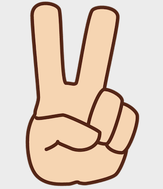
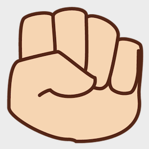
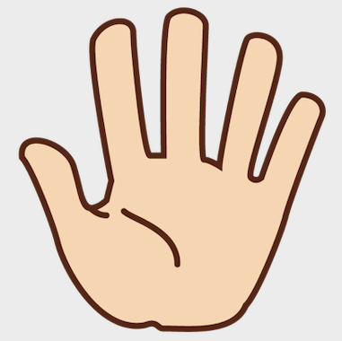

# jQueryRockScissorsPaperGame
Rock Scissors Paper Game using jQuery

<!DOCTYPE html>
<html>

<head>
  <title>jQuery Rock Scissors Paper Game</title>
  
  
  
</head>

<body>
  <form name="form1">
    
jQuery Rock Scisors Paper Game

    

      

        
        
        
      

      

        <input type="button" value="Redo" id="bt1" />
      

    

    

      
      
      
      

        YOU
      

      

        COMPUTER
      

    

    

  </form>
</body>

</html>
